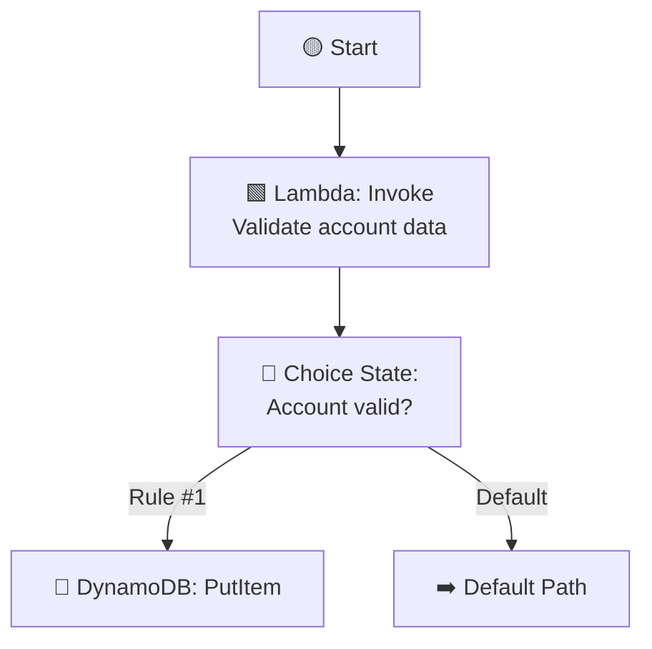
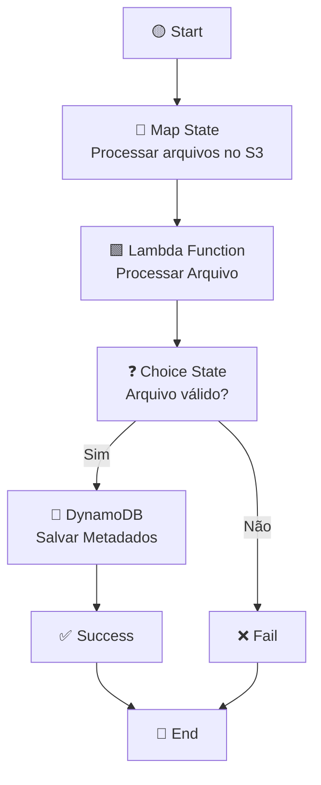

# desafio-step-function-aws
Este diagrama mostra um workflow do Amazon Step Functions para processamento distribuído de arquivos no S3. O fluxo inicia com um Map State, que percorre os arquivos e os envia para uma Lambda. Após o processamento, um Choice State valida os resultados: se válidos, são gravados no DynamoDB; caso contrário, seguem para falha.

### Definição

AWS Step Functions nada mais é do que um construtor visual para criar fluxos de trabalho. Ele é um serviço que facilita a coordenação de aplicativos e microsserviços, usando fluxos de trabalho visuais. 

Ao criar o fluxo de trabalho, não precisamos ter todos os recursos do AWS antecipadamente para começar. Podemos criar o workflow e depois adicionar as definições aos recursos. Mas também podemos ter todos os recursos do AWS implantados em nossa conta antes de começar a trabalhar e depois implantar os recursos necessários neste workflow que teremos.

### Mapa Distribuído para Processar Arquivos no S3

O fluxo começa com um estado inicial (**Start**) e segue para um **Map State**, responsável por iterar sobre múltiplos arquivos presentes no bucket do S3. Esse estado distribui o processamento de forma paralela, garantindo que cada arquivo seja tratado individualmente.

Dentro do **Map State**, cada arquivo é encaminhado para uma **função Lambda**, que executa a lógica de processamento necessária — por exemplo, validação, transformação ou extração de metadados. Após o processamento, o fluxo passa por um **Choice State**, que avalia se o arquivo é válido ou não.

Se o arquivo for considerado válido, os metadados resultantes são armazenados em uma tabela do **DynamoDB**, garantindo persistência e fácil consulta posterior. Esse caminho leva ao estado de **Success**, encerrando o processamento com êxito. Caso o arquivo não seja válido, o fluxo segue para o estado de **Fail**, representando uma falha controlada no processo.
